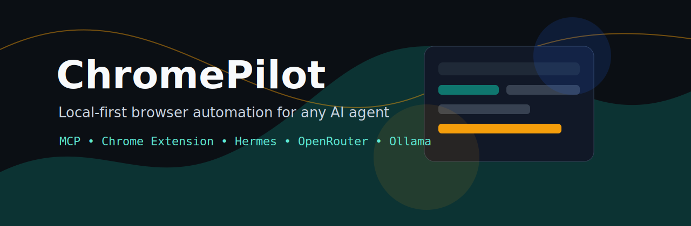

<p align="center">
  
</p>

<p align="center">
  <strong>A local-first Chrome automation bridge for any AI agent.</strong>
</p>

<p align="center">
  <a href="LICENSE"></a>
  
  
  
</p>

ChromePilot lets Codex, Gemini, Claude, Hermes, OpenRouter-backed agents, Ollama-backed agents, and other MCP-capable tools control your real Chrome profiles through one local bridge.

It is a clean-room implementation. It does not depend on Anthropic APIs, Claude login, or a remote browser cloud.

## Why

AI tools are strong at reasoning but often weak at using the browser you are already logged into. ChromePilot provides the missing control layer:

- one extension installed per Chrome profile
- one local controller on `127.0.0.1`
- one MCP surface for external agents
- one side panel for direct browser tasks
- real tabs, real sessions, real profile routing

## Architecture

```text
AI tool / Hermes / Side panel
        |
        v
ChromePilot controller on 127.0.0.1:4777
        |
        v
ChromePilot extension installed per Chrome profile
        |
        v
Real Chrome tabs and logged-in browser sessions
```

## Features

- Profile registry for multiple Chrome profiles
- MCP tools for agent clients
- HTTP endpoints for Hermes, scripts, and local workflows
- Side panel chat with OpenAI-compatible providers
- Low-token page observation with stable refs
- Tab listing, tab selection, navigation
- Click, type, key press, scroll
- Visible-tab screenshot capture
- Optional JavaScript execution for trusted local debugging
- Safety gates for credentials, OTP, payment fields, and dangerous actions

## Current Status

ChromePilot is early but usable. V1 focuses on the hard missing piece: a local bridge from AI tools to real Chrome profiles.

Planned next:

- deeper Chrome DevTools Protocol dispatch
- console and network capture
- download/upload workflows
- stronger human approval middleware
- packaged installer
- automated browser integration tests

## Quick Start

```bash
git clone https://github.com/hshant966/chromepilot.git
cd chromepilot/controller
npm install
npm start
```

Load the extension:

1. Open Chrome.
2. Go to `chrome://extensions`.
3. Enable Developer mode.
4. Click Load unpacked.
5. Select the `extension/` folder from this repo.
6. Open ChromePilot from the toolbar or side panel.
7. Set a stable profile label, for example `work`, `personal`, or `research`.

Repeat this for every Chrome profile you want agents to control.

## Optional Controller Token

For local hardening:

```bash
export CHROMEPILOT_TOKEN="$(openssl rand -hex 24)"
npm start
```

Paste the same token into the extension side panel.

## MCP Setup

Use this config in MCP-capable clients:

```json
{
  "mcpServers": {
    "chromepilot": {
      "command": "node",
      "args": ["/absolute/path/to/chromepilot/controller/src/index.js", "--mcp"]
    }
  }
}
```

Recommended agent instruction:

```text
Use ChromePilot tools. First call chromepilot_profiles_list, then chromepilot_tabs_list for the target profile. Use chromepilot_observe before clicking or typing. Interact only through refs from observe. After each action, observe again and verify progress. Do not perform payments, password entry, deletes, trading, banking, or bulk messaging without asking me first.
```

## Hermes / HTTP Usage

List profiles:

```bash
curl -s http://127.0.0.1:4777/api/profiles
```

Observe a page:

```bash
curl -s -X POST http://127.0.0.1:4777/api/tool/chromepilot_observe \
  -H 'Content-Type: application/json' \
  -d '{"profileId":"work","maxItems":80}'
```

Navigate:

```bash
curl -s -X POST http://127.0.0.1:4777/api/tool/chromepilot_navigate \
  -H 'Content-Type: application/json' \
  -d '{"profileId":"work","url":"https://example.com"}'
```

## Side Panel Provider Setup

ChromePilot side-panel agent mode uses an OpenAI-compatible chat completions endpoint.

OpenRouter:

```bash
export CHROMEPILOT_OPENAI_BASE_URL="https://openrouter.ai/api/v1"
export CHROMEPILOT_OPENAI_API_KEY="your-key"
export CHROMEPILOT_MODEL="openrouter/auto"
npm start
```

Local router:

```bash
export CHROMEPILOT_OPENAI_BASE_URL="http://127.0.0.1:20128/v1"
export CHROMEPILOT_OPENAI_API_KEY="local"
export CHROMEPILOT_MODEL="your-model"
npm start
```

## Tools

| Tool | Purpose |
| --- | --- |
| `chromepilot_profiles_list` | List connected Chrome profiles |
| `chromepilot_tabs_list` | List tabs for a profile |
| `chromepilot_tab_select` | Activate a tab |
| `chromepilot_navigate` | Navigate a tab |
| `chromepilot_observe` | Return compact page state with refs |
| `chromepilot_click` | Click by observed ref |
| `chromepilot_type` | Type by observed ref |
| `chromepilot_press` | Send a key |
| `chromepilot_scroll` | Scroll the page |
| `chromepilot_screenshot` | Capture visible tab screenshot |
| `chromepilot_execute_js` | Disabled by default; trusted debugging only |

## Security Model

ChromePilot is intentionally local-first:

- controller binds to `127.0.0.1`
- optional bearer token for HTTP and extension WebSocket
- sensitive field typing is blocked by default
- `execute_js` is disabled unless both controller and extension opt in
- no API keys are stored by the repo
- no remote browser service is required

Read [SECURITY.md](SECURITY.md) before using ChromePilot on sensitive accounts.

## Related Context

Anthropic's [Claude for Open Source](https://claude.com/contact-sales/claude-for-oss) program currently offers 6 months of Claude Max 20x for eligible open-source maintainers and contributors. The official page says applications are reviewed on a rolling basis, with maintainer guidance around public repos with 5,000+ GitHub stars or 1M+ monthly npm downloads and recent activity.

ChromePilot is built as an open-source attempt to make browser automation available across AI tools, not just one vendor.

## Contributing

Issues, ideas, docs improvements, and adapters are welcome. Start with [CONTRIBUTING.md](CONTRIBUTING.md).
